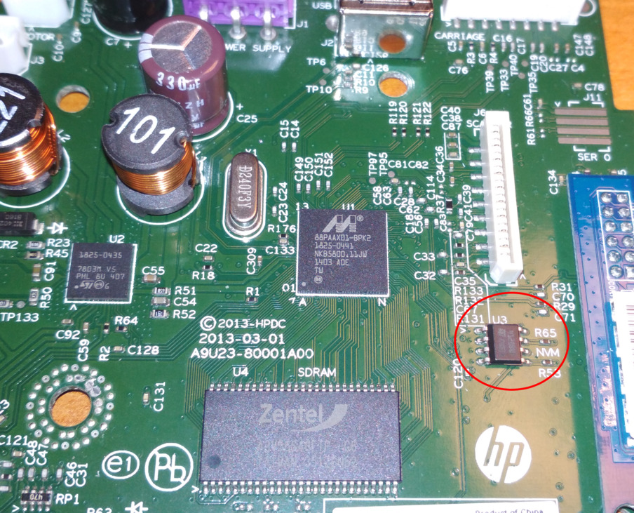

<div align="center">

# HP Deskjet Password Recovery

A project to extract sensitive information from EEPROMs of HP Deskjet
2540 and 2545 (at least) printers.

</div>

## :star: Features

- Recover the serial number and the network name of the printer
- Recover password of the Embedded Web Server (EWS)
- Recover the ESSID and the password of the WiFi access point configured on the printer
- Recover the ESSID and the password of the HP Direct access point

Note that the keys used to encrypt the content may vary from
one printer to another. In this case, only the data offsets are still valid
but they will help you A LOT.

## Targeted EEPROM

On the PCB upper face, dump the content of the NVM EEPROM named `U3`.
It's an EEPROM of the type 24c128, using the protocol I2C.

You can use any CH341 USB dongle to read it, with the help of a program like
[ch341eeprom](https://github.com/command-tab/ch341eeprom).

[](./assets/pcb_eeprom_small.jpg)

## Usage

```
$ python hp_deskjet_password_recovery.py my_eeprom_dump.bin
```

## Example

```
$ python hp_deskjet_password_recovery.py assets/4128BWP.bin
File: assets/4128BWP.bin
SERIAL_NB: CN43T3B2YY0604
NETWORK_NAME: HPFC15B44098CD.local.
EWS_PASS: password
AP_ESSID: 00000000000000000000
AP_PASSWORD: fakefilled
HP_DIRECT_ESSID: HP-Print-CD-Deskjet 2540 series
HP_DIRECT_PASS: 00044449
```

## License

Released under the GPL (General Public License).
